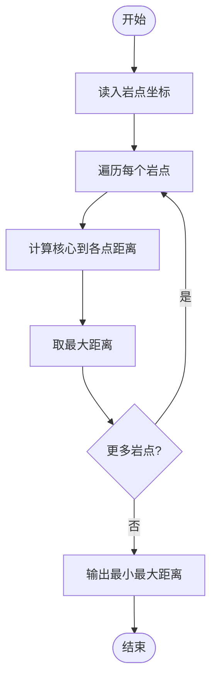
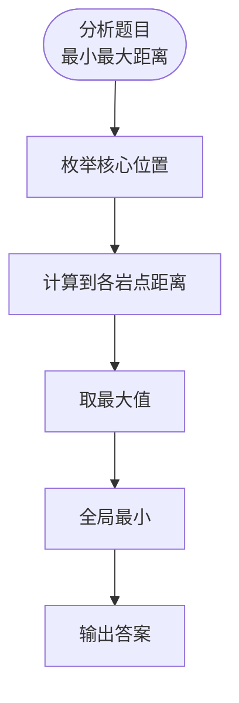

# L3-039 - 攀岩（30 分）

- **时间限制**: 4000 ms
- **内存限制**: 524288 KB
- **代码长度限制**: 16 KB

---

## 题目描述

九条可怜最近接触到了攀岩这项运动。作为一名运动量接近为零的家里蹲，相比于动手攀岩，可怜显然更加享受攀岩运动中动脑的部分，即对攀岩路线的规划。
为了只动脑，可怜设计了一个简易的攀岩机器人来帮她动手。这个机器人由一个核心（大小可以忽略不计）和三个长度至多为 $r$ 的可伸缩机械臂组成，如下图所示：


一面攀岩墙可以看成一个二维的无穷平面，上面有 $n$ 个不同位置的岩点 $p_1, \dots, p_n$。在攀岩开始时，机器人的两个机械臂需要分别抓住岩点 $p_1$ 和 $p_2$，而其核心和第三个机械臂可以在任意位置。攀岩的目标是让机器人有两支机械臂同时抓握住岩点 $p_n$。
在攀岩过程中，机器人需要保证**每时每刻**都有两支机械臂抓握住两个**不同**的岩点。在满足这点的情况下，机器人可以在机械臂长度允许的情况下进行如下移动：
1. 连续地将核心的位置从当前位置移动到任意位置。
2. 用第三条机械臂抓握住一个岩点（可以与某条其他机械臂抓住相同的岩点）。
3. 让一条机械臂松开其抓握的岩点。注意，只有当另外两条机械臂已经抓握住不同岩点时，才能进行这项操作。
**注：**我们假设岩点的大小是无穷小，不会影响机器人的移动，比如机械臂、核心轨迹都可以经过岩点。
下面是一个攀岩过程的例子，假设平面上有四个岩点，坐标分别是 $(0,0), (1,0),(0,1), (1,2)$，则下面展示了一个 $r=\sqrt 2$ 时，即机械臂长度至多为 $\sqrt 2$ 时的攀岩方案。


1. 初始时，可怜将机器人的核心放在 $(0.5, 0)$ 处，第三根手臂随意地放在 $(1,1)$ 处。
2. 机器人的第三机械臂抓握住岩点 $p_3$。
3. 机器人的第二机械臂松开，并移动到 $(1, 0.5)$ 处。
4. 机器人的核心移动至 $(1,1)$，此时第一机械臂的长度到达极限 $\sqrt 2$。
5. 机器人的第二机械臂抓握住岩点 $p_4$。
6. 机器人的第一机械臂松开，并抓握住岩点 $p_4$，完成攀岩目标。

显然，机器人的机械臂长度越短，对可怜的路径规划能力要求越高。但是这个机械臂的长度也不能太短，不然机器人可能无论如何都无法完成攀岩任务。比如在上述任务中，如果机械臂长度小于 $0.5$，那么机器人将无法同时抓握 $p_1$ 和 $p_2$，这意味着它连开始攀岩都无法做到，更别说完成攀岩任务了。
因此，为了在合理范围内尽可能地挑战自己的大脑，可怜希望你对于攀岩馆中的每一项攀岩任务，都帮她计算（在可能完成攀岩任务的前提下）机械臂的最短长度是多少。

### 输入格式:

第一行输入一个整数 $t$ $(t \leq 100)$，表示攀岩馆内攀岩任务的数量。
每个任务的第一行都是一个整数 $n$ $(3 \leq n \leq 1500)$，表示攀岩任务涉及的岩点数量。
接下来 $n$ 行，每行两个整数 $(x_i, y_i)$，表示第 $i$ 个岩点的坐标。输入保证 $0 \leq x_i, y_i \leq 10^6$ 且同一个攀岩任务中的岩点坐标两两不同。
输入保证满足 $n > 100$ 的数据不超过 $3$ 组。

### 输出格式:

对于每个攀岩任务输出一行一个浮点数，表示最短可能的机械臂长度。你的答案在绝对误差或者相对误差不超过 $10^{-6}$ 的情况下都会被视为正确。

### 输入样例:
```in
4
4
0 0
1 0
0 1
1 2
4
0 0
2 0
0 3
2 2
7
0 0
1 0
2 0
2 1
2 2
1 2
0 2
15
13 2
13 3
12 44
6 17
4 71
14 58
4 49
2 51
8 37
1 18
5 43
5 35
1 84
10 23
13 69
```

### 输出样例:
```out
0.99999999498
1.41421355524
1.00000000498
10.13227667717
```

## 示例

### 示例 1

**输入:**
```
4
4
0 0
1 0
0 1
1 2
4
0 0
2 0
0 3
2 2
7
0 0
1 0
2 0
2 1
2 2
1 2
0 2
15
13 2
13 3
12 44
6 17
4 71
14 58
4 49
2 51
8 37
1 18
5 43
5 35
1 84
10 23
13 69
```

**输出:**
```
0.99999999498
1.41421355524
1.00000000498
10.13227667717
```

---

## 题目详解

### 一、解题思路

机器人攀岩问题：机器人有若干机械臂抓握岩点，需要移动核心位置使所有臂重新部署到新岩点。目标是最小化机械臂的最大长度。

核心算法：
1. 对每组测试，遍历所有岩点作为核心位置候选
2. 计算核心到各岩点的距离
3. 最小化最大距离（最小化最大机械臂长度）
4. 使用二分答案或直接求最小值

### 二、代码流程说明

1. 读入岩点数 n
2. 读入 n 个岩点坐标
3. 遍历每个岩点作为核心位置
4. 计算核心到其他岩点的距离
5. 取最大距离作为该方案的机械臂长度
6. 输出所有方案中的最小最大长度

### 三、代码流程图



### 四、解题流程图


